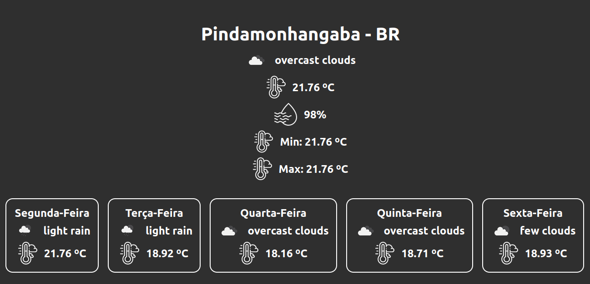

# Weather App

---

<a href='https://celorocha.github.io/weather-app/' target='_blank'>Acesse Online.</a>

---

## Conhecimentos demonstrados:

- Javascript;
- CSS;
- HTML(JSX);
- ReactJS;
- API(Open Weather API);
- React Hook;
- React Component;
- Web/Celular;

---

## O site:

    

O site demonstra o tempo atual e a previsão para os próximos 5 dias do local pesquisado.